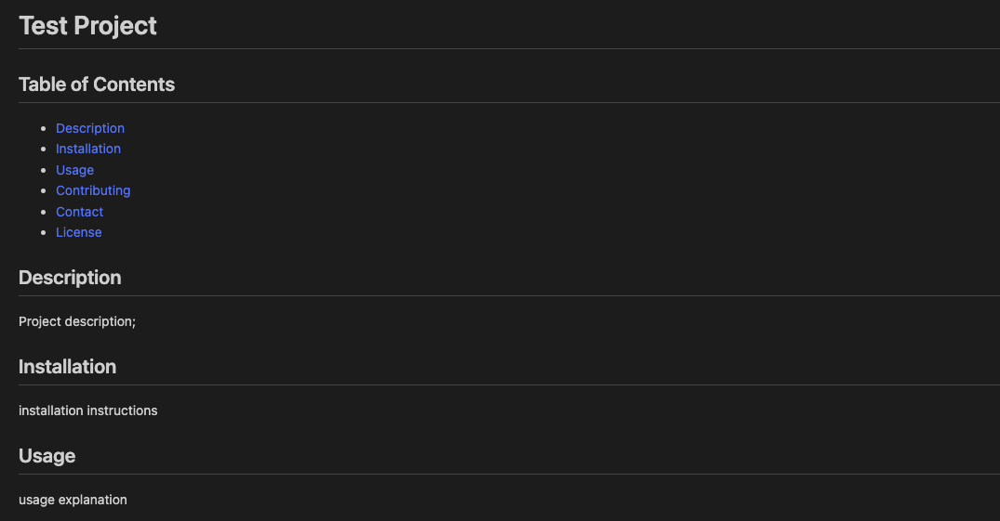
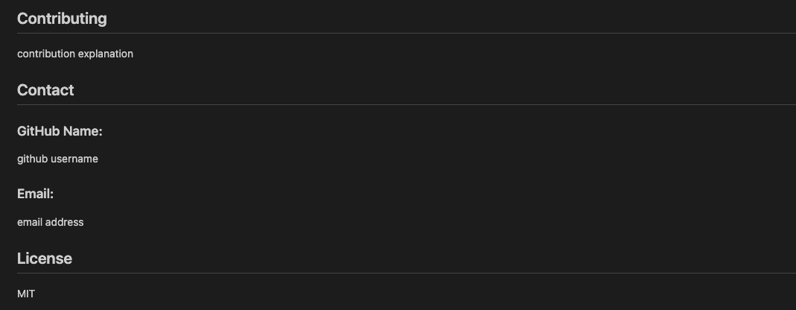

 # Professional-README-Generator

## Table of Contents
  * [Description](#description)
  * [Installation](#installation)
  * [Usage](#usage)
  * [Contributing](#contributing)
  * [Contact](#contact)
  * [License](#license)
        
## Description
  This project will help a user quickly create a README without having to worry about applying markdown syntax.
  

## Installation

Clone this directory to a directory of your choosing using your terminal. Open the file in VS Code or your preferred editor. Open the terminal in VS Code and now you're ready to run the app.

## Usage

  After installation is complete, run the following code: ‘node inex.js’ in the terminal. Answer the prompts and after completion, you should see a console log showing your answers to your prompts, a message that says ‘Successfully created readme.md!’, and you should see your README.md file appear. It’s generated in mark down syntax so you can copy and paste that code into your project!
  
  README Screenshot
  

  README Screenshot
  

## Contributing

  Thanks for your interest!

## Contact

Contact me using the following links:

## Tests

To test this project, open up the file in VS Code and then open the terminal and type in "node index.js". Answer the prompts and view the README.md file created.

### GitHub Name:
  https://github.com/kateleighb3

### Email:
  kbaldw3@gmail.com

## License

  MIT
          

